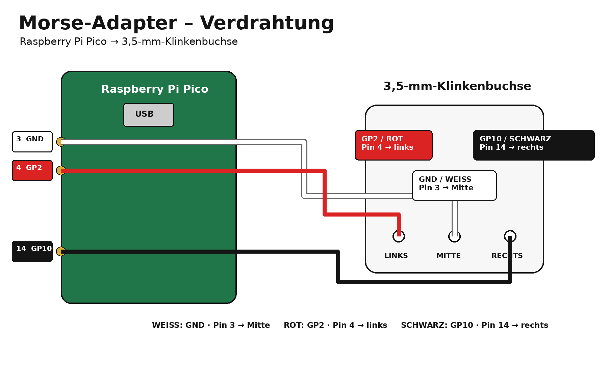

# Morse-Adapter

USB-HID adapter for connecting an iambic Morse paddle to a computer or mobile device using a **Raspberry Pi Pico / RP2040**.

Developed by **Roland Schaal**.

## Features

- **Morse Mania:** left paddle = `a`, right paddle = `s`
- **VBand / Morse Invaders:** left paddle = `[`, right paddle = `]`
- Simultaneous paddle input (squeezing) is supported
- Hold both paddles for **15 seconds** to switch mode
- The selected mode is stored in EEPROM
- LED indication: 1 blink = Morse Mania, 2 blinks = VBand / Morse Invaders

## Wiring



| Raspberry Pi Pico | Cable color | 3.5 mm TRS connection |
| --- | --- | --- |
| **GP2 – physical Pin 4** | 🔴 Red | **Tip** |
| **GND – physical Pin 3** | ⚪ White | **Sleeve** |
| **GP10 – physical Pin 14** | ⚫ Black | **Ring** |

```text
Raspberry Pi Pico                 3.5 mm TRS jack

GP2  – Pin 4  ───── RED ───────► TIP
GND  – Pin 3  ───── WHITE ─────► SLEEVE
GP10 – Pin 14 ───── BLACK ─────► RING
```

There are exactly three connections. The inputs use the Pico's internal pull-up resistors; the paddle contacts switch the corresponding GPIO to GND.

## Parts list

- 1× Raspberry Pi Pico / RP2040
- 1× 3.5 mm stereo jack socket for the Morse paddle
- 1× USB cable suitable for the Raspberry Pi Pico
- Hook-up wire
- Solder
- 1× 3D-printed enclosure (base and cover)

## Arduino IDE setup

Use the **Raspberry Pi Pico/RP2040 Arduino Core by Earle F. Philhower**.

Select: `Tools -> USB Stack -> Adafruit TinyUSB`

The sketch uses `Keyboard.h` and `EEPROM.h`.

## Firmware

The firmware is in [Morse-Adapter.ino](Morse-Adapter.ino).

### Mode switching

Both paddles remain fully usable for normal iambic squeezing. If both paddles are held continuously for **15 seconds**, the adapter releases the current HID keys, changes mode, stores the new mode in EEPROM and indicates it with the onboard LED. Both paddles must then be released before normal input resumes.

## 3D printed enclosure

The enclosure was designed for this adapter. Source/print files:

- `Gehaeuse_Morse_Adapter_2_v16_001.3mf`
- `Gehaeuse_Morse_Adapter_2_v16_001.step`
- `Gehaeuse_Morse_Adapter_2_v16_002.step`

## Photos

Project photos show the finished adapter, the Raspberry Pi Pico inside the enclosure, and the wiring between the Pico and the 3.5 mm paddle jack.

## Author

**Roland Schaal**

The **Morse-Adapter firmware and project** are developed by Roland Schaal.

The Raspberry Pi Pico/RP2040 Arduino Core used to compile the firmware is developed by **Earle F. Philhower**.
